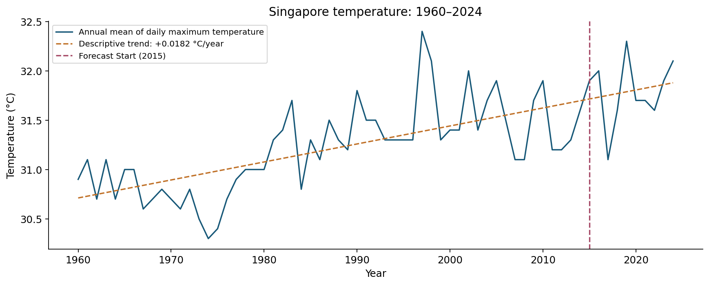

# Singapore Temperature Forecasting

**Time series analytics and forecasting | Python · Data quality · Statistical modeling · Reproducible reporting**

This case study uses **65 annual observations from 1960–2024** to compare simple
exponential smoothing (SES), ARIMA and rainfall-assisted ARIMAX for Singapore
temperature forecasting. Models are fitted on 55 years and evaluated on a
ten-year chronological holdout.

*An individual academic project using a supplied SingStat climate export and a
simulated facilities planning brief. Numerical findings are verified; planning
recommendations are proposals for further validation.*

- **Business question:** Does annual rainfall improve temperature forecasts enough to justify a more complex model for long-term facilities planning?
- **Key finding:** Adding rainfall increased holdout RMSE from 0.4736°C for ARIMA to 0.6156°C for ARIMAX, even with observed holdout rainfall supplied. SES achieved 0.4735°C, almost identical to ARIMA. This supports keeping a simple benchmark and requiring further validation before using a more complex model.
- **Project contribution:** Validate and reshape annual climate data, compare three forecasting approaches, examine model diagnostics and prediction intervals, and translate the evidence into planning recommendations with proposed validation measures.
- **Core strengths:** Python data analysis, time series forecasting, data quality controls, model evaluation, reproducible reporting, and communication of business decisions with uncertainty.

[Case study](reports/CASE_STUDY.md) · [Complete notebook](notebooks/analysis.ipynb) ·
[Data dictionary](data/README.md) · [Model comparison](outputs/tables/metrics.csv)

## 1. Business Context and Objectives

**Simulated business brief:** a Singapore facilities planning analyst needs a
transparent annual temperature reference for reviewing long-term heat exposure
assumptions. The decision is whether rainfall adds enough predictive value to
justify a more complex model. This dataset supports model assessment; translating
temperature into cooling demand, staffing or costs would require operational data.

Contributions include reshaping a statistical export, validating annual observations,
comparing three model families, examining diagnostics and communicating model risk.

## 2. Data and Analytical Approach

The supplied SingStat export identifies National Environment Agency as its source.
The target is the **annual mean of daily maximum air temperature**, measured in °C;
the second series is annual total rainfall in mm. It contains one observation per
year from 1960 through 2024. See the [dictionary](data/README.md) for provenance and scope.

- Validate 65 unique, consecutive years, numeric values, missingness and IQR flags; retain all observations.
- Fit models on 1960–2014 (55 years); evaluate fixed-origin forecasts on 2015–2024 (10 years).
- Compare eight ARIMA specifications and twelve ARIMAX specifications using training AIC.
- Preserve ARIMA(0,1,1), no drift, and ARIMAX(1,0,0), constant plus same-year rainfall, from the academic analysis.
- Inspect stationarity, residual ACF and Q–Q plots; generate model prediction intervals.

ARIMAX uses observed rainfall for the holdout period, making it a **conditional
retrospective evaluation**. Full-sample correlation and CCF guided the original
rainfall specification, so feature exploration also accessed the holdout period.

## 3. Key Findings and Business Insights

| Model | Holdout MAE (°C) | Holdout RMSE (°C) | MAPE (%) | Holdout R² |
|---|---:|---:|---:|---:|
| SES | 0.4212 | 0.4735 | 1.3200 | -1.2673 |
| ARIMA(0,1,1) | 0.4213 | 0.4736 | 1.3203 | -1.2682 |
| ARIMAX(1,0,0) | 0.5532 | 0.6156 | 1.7340 | -2.8321 |

Metrics cover the same ten annual holdout observations. MAPE uses temperatures on
the Celsius scale and is secondary to MAE/RMSE. Negative R² means squared errors
exceed those of the holdout mean reference; that reference uses future observations
and is not an implementable forecast at the 2014 origin.


**A simple baseline remains competitive.** SES and ARIMA differ by less than
0.0002°C in RMSE. Retain SES as a comparison benchmark and test improvements across
additional forecast origins before increasing model complexity.

**Rainfall does not improve this holdout comparison.** The full-sample Pearson
correlation is -0.303, but the conditional ARIMAX forecasts have larger errors.
Evaluate external features with training-only selection and realistic future
availability. Compare MAE/RMSE and interval coverage at each forecast horizon.

**A rising historical trend can coexist with flat forecasts.** The descriptive
linear slope is approximately +0.01824°C/year over 1960–2024. SES and no-drift
ARIMA produce flat multi-year point forecasts, so they provide level references
with a limited representation of future warming.



## 4. Recommendations and Validation

| Evidence | Planning implication | Proposed action | Proposed validation |
|---|---|---|---|
| SES and ARIMA have nearly identical holdout errors | Complexity has little demonstrated payoff here | Keep a simple benchmark in every model review | Rolling-origin MAE/RMSE by horizon; compare identical available information |
| Conditional ARIMAX RMSE is 0.6156°C | Rainfall adds input requirements without improved performance in this comparison | Require credible rainfall scenarios and training-only feature selection | Forecast errors and interval coverage, including uncertainty in rainfall inputs |
| Historical slope is positive; level forecasts are flat | Long-horizon scenarios need explicit assumptions | Compare trend-aware specifications in a future study | Backtesting across origins; bias in °C; prediction interval width and coverage |
| Annual observations compress daily variation | Annual climate references cannot define heat safety thresholds | Obtain daily weather and operational records before business use | Proposed operational forecast error and threshold exceedance metrics, defined with the new data |

These are proposed next steps; no operational deployment, cost savings or business impact was measured.

## 5. Limitations and Next Steps

Only 65 annual observations and one ten-year holdout are available. Annual data
cannot reveal within-year seasonality; the original period-two decomposition is
an imposed exploratory pattern. ADF results are evidence about a specified
unit-root test, rather than proof of stationarity or nonstationarity. Residual
plots and normality tests do not prove independence or model adequacy.

AIC is used within a model family and its fitting convention; SES and ARIMA AIC
values are not directly interchangeable. Candidate convergence flags are exported
and optimizer warnings remain visible. The original no-intercept OLS is retained
as an intermediate diagnostic, not interpreted as a causal rainfall effect.

The [case study](reports/CASE_STUDY.md) explains the future scenario's information
cutoff and how to interpret the prediction intervals. Data coverage stops at 2024.

## 6. Repository Navigation

```text
singapore-temperature-forecasting/
├── README.md
├── requirements.txt
├── data/
│   ├── README.md
│   └── annual_climate.csv
├── notebooks/analysis.ipynb
├── reports/CASE_STUDY.md
├── src/
│   ├── __init__.py
│   ├── analysis.py
│   ├── reporting.py
│   └── run.py
└── outputs/
    ├── summary.json
    ├── figures/
    └── tables/
```

| Resource | Purpose |
|---|---|
| [Case study](reports/CASE_STUDY.md) | Decision narrative and method limitations |
| [Notebook](notebooks/analysis.ipynb) | Complete analytical walkthrough with executed evidence |
| [Analysis functions](src/analysis.py) | Data checks, candidate fits, forecasts and metrics |
| [Reporting functions](src/reporting.py) | Generate English figures and CSV evidence |
| [Candidate ARIMA table](outputs/tables/arima_candidates.csv) | Training AIC and convergence status |
| [Candidate ARIMAX table](outputs/tables/arimax_candidates.csv) | Rainfall model candidates and convergence status |
| [Model parameters](outputs/tables/model_parameters.csv) | Coefficients and fitted parameter p-values |
| [Data quality](outputs/tables/quality.csv) | Counts and screening flags |

## 7. How to Run

Tested with Python 3.13.9. Run from this project directory.

1. Install dependencies: `python -m pip install -r requirements.txt`.
2. The unchanged source CSV is included at [data/annual_climate.csv](data/annual_climate.csv); no separate download is needed.
3. Generate tables and figures: `python -m src.run --data data/annual_climate.csv`.
4. Open `notebooks/analysis.ipynb` with this environment and run all cells from the notebook directory.

An external input is also supported: `python -m src.run --data PATH_TO_ORIGINAL_CSV`.
The command and executed notebook were verified using the included CSV. The
notebook reads it by default; `CLIMATE_DATA_PATH` optionally selects an external
file with the same export format.

## 8. Technologies

| Tool / method | Demonstrated skill | Evidence |
|---|---|---|
| Python, pandas, NumPy | Reshaping exports, annual schema validation, numeric computations | [Loader and analysis](src/analysis.py) |
| statsmodels | SES, ARIMA/ARIMAX, AIC candidate comparisons, prediction intervals | [Model comparisons](outputs/tables/metrics.csv) |
| SciPy | Normal Q–Q diagnostics and Shapiro–Wilk test | [Residual evidence](outputs/tables/diagnostics.csv) |
| Matplotlib | Clear forecast and diagnostic figures | [Holdout chart](outputs/figures/holdout_comparison.png) |
| Jupyter | Reproducible analytical documentation | [Notebook](notebooks/analysis.ipynb) |
| Command-line reporting | Repeatable generation of analytical evidence | [Entry point](src/run.py) |

The project demonstrates statistical forecasting, data quality checks and decision
communication. Its scope is a local annual-data analysis workflow.
