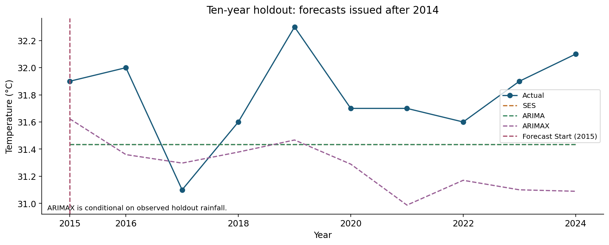
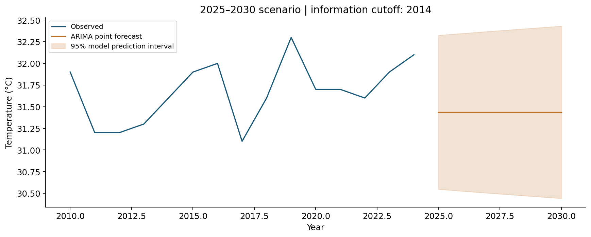

# Singapore Temperature Forecasting: Model Complexity and Planning Risk

## Executive Summary

Keep a simple temperature model as a review benchmark and require external
predictors to demonstrate an improvement under realistic information constraints.
On ten annual holdout observations (2015–2024), SES achieved RMSE 0.4735°C,
ARIMA(0,1,1) 0.4736°C and rainfall-assisted ARIMAX(1,0,0) 0.6156°C. The latter used
observed holdout rainfall and still performed worse in this comparison.

This is an individual academic case with a simulated facilities planning brief.
The deliverables are a validated input workflow, model evidence, figures and a
reproducible report. Operational outcomes were not measured.

## 1. Decision and Intended Audience

The simulated audience is a facilities planning manager evaluating an annual
temperature reference. The analytical questions are: how stable is a simple
forecast, does annual rainfall add predictive value, and what uncertainty should
accompany a multi-year scenario? The data do not include cooling demand, costs,
work schedules or exposure measurements, so the report stops at climate model evidence.

## 2. Data and Quality

The source file is a SingStat Table Builder annual climate export attributed to
National Environment Agency. Temperature denotes the annual mean of daily
maximum air temperature, rather than an annual extreme. Rainfall is an annual
total. The selected series contain 65 observations each from 1960–2024, with no
missing values, duplicate years, negative observations or IQR flags. The loader
retains the original measurements and explicitly checks the expected annual coverage.

Temperature averages 31.2954°C across all 65 years, with sample standard deviation
0.4751°C. Its observed annual range is 30.3–32.4°C. Annual rainfall averages
2,151.9031 mm, with sample standard deviation 433.5539 mm. These describe the
supplied historical period, not current weather or a population confidence interval.

The full-sample descriptive temperature slope is +0.0182386°C/year. This fitted
line summarizes historical change; it does not identify a causal mechanism or
establish a validated future trajectory.

## 3. Analytical Design

### 3.1 Fixed chronological holdout

Models are trained on 55 observations from 1960–2014 and issue a fixed-origin
ten-step forecast for 2015–2024. There is no annual refitting in this evaluation.
MAE and RMSE use °C; MSE uses °C². R² uses the holdout mean as its denominator reference.
MAPE divides absolute errors by the observed Celsius temperature plus the original
1e-10 numerical guard and is reported as a percentage. Celsius has an arbitrary
zero, so percentage error is secondary to the original-unit errors.

### 3.2 Baseline and univariate model

SES uses estimated initialization and optimized smoothing. The eight ARIMA candidates
combine orders (1,1,1), (0,1,0), (1,1,0), (0,1,1) with no drift (`n`) or linear drift (`t`).
The preserved selected model is ARIMA(0,1,1), `trend='n'`, with training AIC 34.5645.
Its point forecasts are flat, approximately 31.4359°C throughout the ten-year holdout.
SES forecasts approximately 31.4360°C.

The level ADF test on the full sample gives p=0.8172. First-differenced training
data give p=0.1711 under AIC lag selection. These tests do not reject their unit-root
null at 5%; they do not by themselves prove that additional differencing is required.
The original study explored two differences, then retained one to avoid possible
overdifferencing. The imposed period-two decomposition is shown for completeness;
annual observations do not allow inference about within-year seasonality.

### 3.3 Rainfall-assisted model

Full-sample Pearson correlation is -0.3032. The exploratory CCF examines lags
0–14 using approximate bounds ±1.96/√65; the original analysis retained same-year
rainfall. This is an association screen, not causal identification, and uses the
full sample including holdout observations.

An intermediate OLS regression through the origin (`yt ~ xt0 - 1`) is retained.
Its coefficient cannot support a causal interpretation: forcing a zero intercept
is a restrictive assumption for temperature in Celsius.

Twelve ARIMAX candidates combine orders (0,0,0), (1,0,0), (0,0,1), (1,0,1) with
`n`, `c` or `t` trends. The preserved selected specification is ARIMAX(1,0,0),
constant plus rainfall, with AIC 24.4815. It uses actual rainfall from 2015–2024
when producing conditional forecasts. A planning workflow would need rainfall
forecasts or scenarios, with their uncertainty propagated to the temperature forecast.

Candidate AIC values and convergence flags are exported. Numerical optimizer warnings
remain visible. AIC should be read within the same likelihood and fitting convention;
the SES AIC formula differs from state-space ARIMA. The model ranking alone does
not establish useful forecast performance.

## 4. Results and Interpretation

| Model | MAE (°C) | RMSE (°C) | MAPE (%) | R² |
|---|---:|---:|---:|---:|
| SES | 0.4212 | 0.4735 | 1.3200 | -1.2673 |
| ARIMA(0,1,1) | 0.4213 | 0.4736 | 1.3203 | -1.2682 |
| ARIMAX(1,0,0) | 0.5532 | 0.6156 | 1.7340 | -2.8321 |

SES is numerically lowest on holdout RMSE, with an immaterial difference from ARIMA.
No significance test of the error difference was performed. Rainfall-assisted
ARIMAX has larger holdout errors; lower training AIC does not imply better future predictions.
All holdout R² values are negative, warranting further validation before operational use.

Residual ACF, Q–Q plots, a residual scatter walkthrough and normality tests support
diagnostic review. A non-significant Shapiro–Wilk result means the test did not
reject normality; it does not prove normality. The first ARIMA residual reflects
initialization and is excluded from its Q–Q and public residual ACF views. The original
full-residual ACF remains inspectable in the private baseline. This plotting choice
changes neither fitted models nor forecast metrics.

## 5. Future Scenario and Uncertainty

The original 2025–2030 values are the final six steps of a sixteen-year forecast
issued by a model fitted through 2014. Their approximately 31.4359°C point estimate
is a **2014-origin scenario**, even though observations through 2024 are displayed
for comparison. It is not a forecast updated with 2024 information. The output
records the cutoff explicitly. No-drift ARIMA gives a constant point estimate;
the scenario does not predict a slight temperature increase.

The shaded 95% model prediction intervals describe future observations conditional
on the model assumptions. They do not cover every source of uncertainty, including
model selection and structural climate changes. SES intervals use 1,000 additive
simulations with seed 64; ARIMA/ARIMAX intervals use the fitted model forecast distribution.
ARIMAX intervals additionally condition on supplied rainfall values.

## 6. Proposed Actions and Success Measures

Retain SES as a transparent benchmark. In a future study, compare trend-aware
models using rolling forecast origins and identical training information. Define
success using MAE/RMSE by annual forecast horizon, bias in °C, and empirical 95%
prediction interval coverage and width. No improvement threshold is imposed without
an operational tolerance or cost model.

Before including rainfall, repeat feature exploration inside each training window
and validate with realistically available rainfall scenarios. Record the origin,
input cutoff and scenario for every forecast so downstream users can interpret it.

For an operational heat or cooling analysis, acquire daily weather and matched
operational outcomes. Define relevant exposure windows, operational units and
decision thresholds with those additional records. Annual national series alone
cannot demonstrate cost savings, heat incident reduction or campaign effectiveness.

## 7. Reproducibility and Scope

The [notebook](../notebooks/analysis.ipynb) exposes input validation, exploratory
analysis, candidate selection, model coefficients, diagnostics, holdout comparison
and the future scenario. The [command-line entry point](../src/run.py) generates
the linked tables and charts from the included [annual climate CSV](../data/annual_climate.csv).
The source export has a neutral filename and unchanged contents. Academic submissions
and private verification records are physically outside the project.

The original numerical workflow and the modular implementation were compared on
candidate AICs, fitted parameters and values, residuals and forecast arrays. The
documented workflow and notebook were executed with Python 3.13.9 and the pinned
dependencies. Detailed provenance and verification records remain private.
